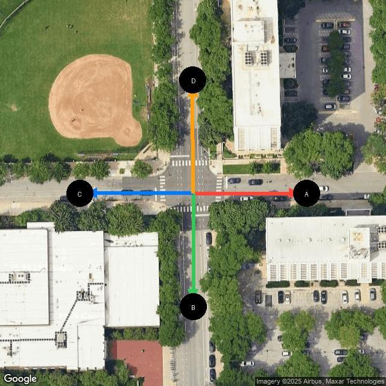
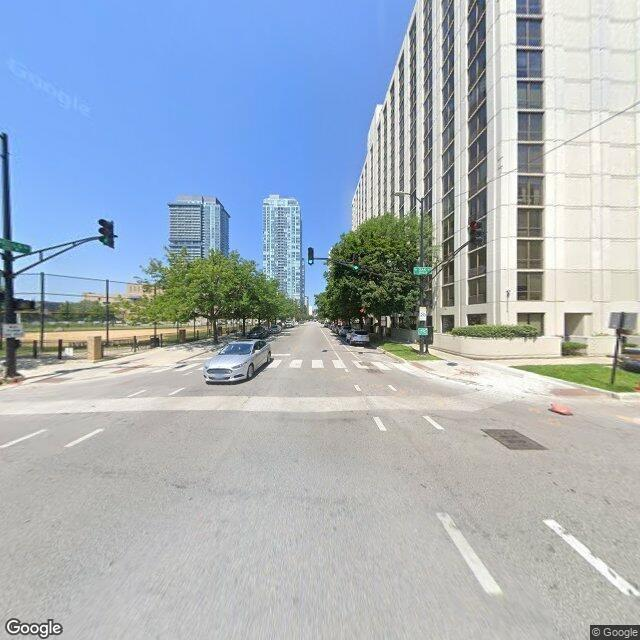
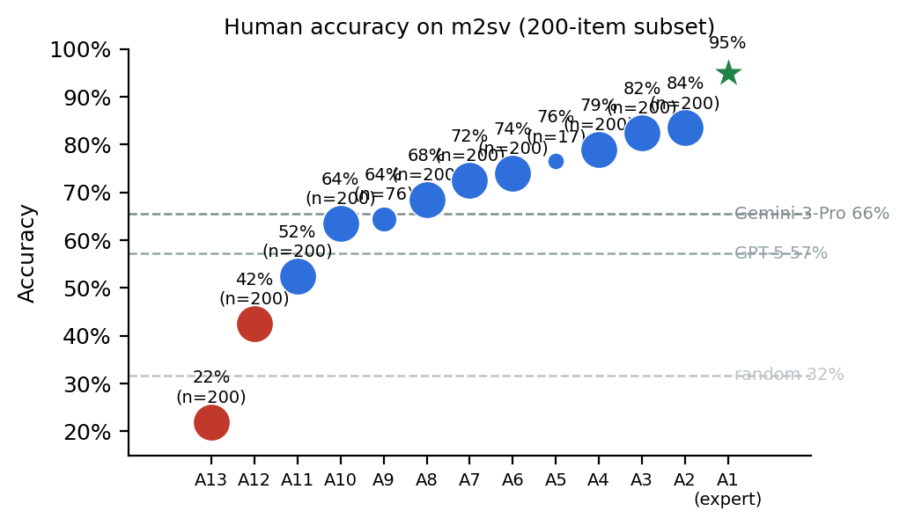
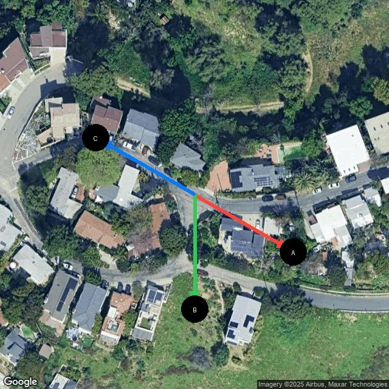
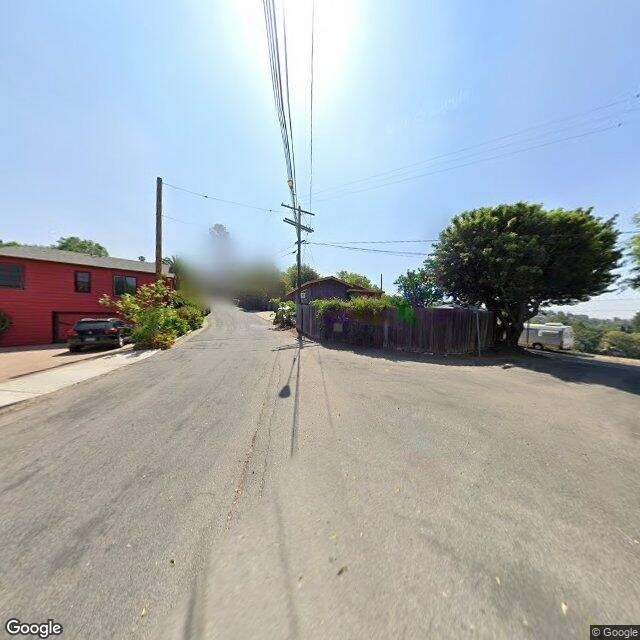

# m2sv: A Scalable Benchmark for Map-to-Street-View Spatial Reasoning

**Can vision–language models tell which way a photo faces?** Given a north-up
overhead map of an intersection with labeled candidate directions and a
Street-View photo taken there, the model must pick the direction the camera is
looking. This isolates a single cross-view spatial-reasoning primitive —
aligning an allocentric map with an egocentric image — that frontier VLMs are
surprisingly bad at.

📄 **[Paper (CTB@ICML 2026)](publications/icml2026/2026-01-28/m2sv_paper.pdf)**
 · 🕹️ **[Try the human eval](https://m2sv.yosubshin.com)**
 · 🤗 **[Dataset: `yosubshin/m2sv-20k`](https://huggingface.co/datasets/yosubshin/m2sv-20k)**
 · 📜 **[Changelog](CHANGELOG.md)**

---

## The task

<p align="center">
  
  
</p>

*"Which labeled direction on the map corresponds to the direction the Street-View
photo was taken?"* Each example pairs a north-up map (2–7 labeled rays, median 3)
with a photo captured within ~5 m of the intersection center. Solving it requires
road-topology reasoning and stable-landmark matching while ignoring transient cues
(cars, lighting). **m2sv-20k** spans 32 cities; **m2sv-sft-11k** adds reasoning
traces for fine-tuning.

## Headline results

The best VLM sits **~22 points below** attentive humans and **30 below** the
expert; most open models are near chance. Task-specific SFT+RL helps but doesn't
close the gap.

| Model | N | Accuracy |
|---|---:|---:|
| **Human (expert)** | 200 | **95.0%** |
| **Human (engaged, n=7)** | 200 | **73.2% ± 7.4** |
| Gemini-3-Pro | 1k | 65.2% |
| GPT-5 | 1k | 57.2% |
| Gemini-2.5-Pro | 1k | 47.2% |
| Qwen3-VL-235B-A22B (Thinking) | 1k | 42.7% |
| Qwen3-VL-8B-Instruct | 1k | 35.5% |
| Random baseline | 1k | 31.4% |

*Adaptation (Qwen3-VL-8B): Base 34.3% → SFT 39.8% → SFT+RL 43.9%.*

Human accuracy is high but effort-dependent, and attentive annotators agree with
each other and the expert (Cohen's κ up to 0.76) far more than the best model does:

<p align="center">
  
</p>

## Why models fail

A qualitative analysis surfaces recurring failure modes — egocentric/allocentric
(left–right) inversion, over-reliance on unstable cues (roof color, lighting),
landmark misbinding, and symmetry traps. Difficulty is driven by **road-azimuth
symmetry**: near-even (Y-shaped) intersections are the hardest for every model
(humans stay robust).

<p align="center">
  
  
</p>

*Example: ground truth A, model predicts C — it reasons about a left curve as if it
were a right curve (egocentric/allocentric inversion).*

## Reproduction

```bash
git clone https://github.com/yosubshin/m2sv && cd m2sv
pip install -r requirements.txt        # or use the per-component requirements below
```

**Evaluate a VLM** on the benchmark:
```bash
python evaluate_vlm_api.py yosubshin/m2sv-20k \
  --provider gemini --model gemini-3-pro --out results/gemini-3-pro.json
```

**Rebuild the dataset from blueprints** (images rendered on demand to respect
licensing):
```bash
python freeze_blueprint.py --out blueprints/20k/train-val-20k.jsonl --total-samples 20000 --seed 42
python render_from_blueprint.py blueprints/20k/validation.jsonl m2sv-20k-validation --output-root data/hf
```

**Fine-tune** (Qwen3-VL-8B via LoRA SFT + GRPO RL): see `sft/` and the Slurm
launchers in `scripts/` (e.g. `scripts/grpo_job.slurm`, `scripts/eval_job.slurm`).

**Host the human-eval web app** (FastAPI + SQLite; collects answers + per-item
timing):
```bash
pip install -r human_eval/requirements.txt
python human_eval/build_dataset.py            # freeze the 200-problem set + images
python -m uvicorn human_eval.app:app --host 0.0.0.0 --port 8000
```
See [`human_eval/README.md`](human_eval/README.md) for the design and deployment notes.

**Regenerate the paper's human-baseline figures** (from the committed,
anonymized, PII-free data bundle — no database needed):
```bash
uv run analysis/human_baseline_figs.py      # accuracy dist, κ heatmap, difficulty
uv run analysis/plot_symmetry_accuracy.py   # model accuracy vs symmetry
```

## Repository layout

| Path | Contents |
|---|---|
| `evaluate_vlm_api.py`, `evaluate*.py` | VLM evaluation entrypoints |
| `freeze_blueprint.py`, `render_from_blueprint.py` | dataset blueprint freeze + on-demand rendering |
| `sft/`, `scripts/` | SFT/RL training code and Slurm jobs |
| `human_eval/` | hostable human-evaluation web app (live at m2sv.yosubshin.com) |
| `analysis/` | analysis + figure scripts and the anonymized human-baseline bundle |
| `publications/icml2026/2026-01-28/` | the camera-ready paper, figures, and bibliography |
| `blueprints/`, `data/` | dataset blueprints and rendered splits |

## Citation

```bibtex
@inproceedings{shin2026m2sv,
  title     = {m2sv: A Scalable Benchmark for Map-to-Street-View Spatial Reasoning},
  author    = {Shin, Yosub and Buriek, Michael and Molybog, Igor},
  booktitle = {Combining Theory and Benchmarks (CTB) Workshop at ICML},
  year      = {2026}
}
```

Older release notes and per-version metrics are in [`CHANGELOG.md`](CHANGELOG.md).
